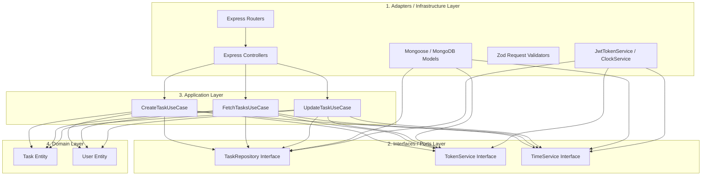

# Todo App Server: Clean & Hexagonal Architecture Guide

An enterprise-grade, highly maintainable REST API built with **Node.js**, **Express**, and **TypeScript**. This system implements a rigorous **Hexagonal Architecture** (also known as *Ports & Adapters*) combined with a lightweight **CQRS-lite** read pattern to ensure strict separation of concerns, complete testability, and top-tier database performance.

---

## Architectural Visualizer

This project is built around the core rule that **dependencies only point inwards**. Frameworks, databases, and network adapters reside in the outer ring (adapters), while business rules and rules of truth reside in the core domain.



---

## Core Folder & File Directory Guide

```text
server/
├── src/
│   ├── config/          # Database connection and environment configurations
│   ├── controller/      # Adapters: Translates HTTP Request -> Use Cases -> HTTP Response
│   ├── entities/        # Core Domain: Pure business entities (Zero external dependencies)
│   ├── interfaces/      # Contract Definitions (Repository & Service Interfaces)
│   ├── middleware/      # Global & Route middlewares (Auth, Error handling, Zod Validators)
│   ├── models/          # Database models (Mongoose)
│   ├── providers/       # Setup for third-party integrations (AI, Redis, etc.)
│   ├── repositories/    # Adapters: Implementations of Repository Ports (Mongo/Mongoose)
│   ├── routes/          # Routers: Dependency Injection assembly and route registration
│   ├── services/        # Cross-cutting concerns (Token verification, Time services)
│   ├── types/           # Shared TypeScript type definitions
│   ├── use-cases/       # Application logic orchestrating Domain entities and Ports
│   ├── utils/           # Shared utility classes (API standard responses, error classes)
│   ├── validators/      # Zod validation schemas for request bodies/queries/params
│   ├── app.ts           # Express Application definition
│   └── index.ts         # Server entry point
├── tests/               # Unit, integration, and API endpoint tests
└── docker-compose.yml   # Infrastructure (Local MongoDB)
```

---

## The Architectural Lifecyle (Data Flow)

Every request follows a rigorous, unidirectional lifecycle to guarantee data integrity, type safety, and error containment:

```
[Client Request]
       │
       ▼
 [Router Layer]      --> Applies Route-level Authentication & Role checks
       │
       ▼
 [Validator Layer]   --> Enforces Zod Schema (body / query / params validation)
       │
       ▼
[Controller Layer]   --> Extracts req params, handles DTO mapping, triggers Use Case
       │
       ▼
 [Use Case Layer]    --> Applies application-specific business rules
       │
       ▼
 [Repository Port]   --> Abstract interface (Port) containing query contracts
       │
       ▼
[Mongo Repository]   --> Mongoose implementation (Adapter) running queries
       │
       ▼
  [Database]         --> MongoDB reads/writes
```

---

## Key Architectural Patterns

### 1. Inward Dependency Injection (DI)
Use Cases and Controllers never instantiate their own services or databases. They depend only on **Abstract Interfaces (Ports)**. Wiring up occurs in a single centralized location: the **Router**.

For example, looking at `src/routes/task.route.ts`:
```typescript
// 1. Instantiate concrete adapters
const taskRepository = new MongoTaskRepository();
const tokenService = new JwtTokenService();
const timeService = new ClockService();

// 2. Inject repository and services into Use Cases
const createTaskUseCase = new CreateTaskUseCase(taskRepository, timeService);
const fetchTasksUseCase = new FetchTasksUseCase(taskRepository);
const updateTaskUseCase = new UpdateTaskUseCase(taskRepository);

// 3. Inject Use Cases into Controller
const taskController = new TaskController(createTaskUseCase, fetchTasksUseCase, updateTaskUseCase);
```

---

### 2. High-Performance CQRS Read Model (`TaskSummary`)
To avoid loading heavy fields (such as `description`, `currentDate`, etc.) when querying lists, the codebase divides the Task domain representation into two formats inside `src/entities/task.entity.ts`:

1. **`Task` Entity (Domain Class):** Holds full database fields, invariants, validations, and the `update()` business logic. Used for writes, updates, and creation.
2. **`TaskSummary` Interface:** A lightweight subset representing list rows:
   ```typescript
   export interface TaskSummary {
       id: string;
       title: string;
       status: 'pending' | 'completed';
       endDate: string;
   }
   ```

Inside the Repository, we apply a high-performance **Lean Select** projection:
```typescript
async getTaskSummaries(mobileNo: string): Promise<TaskSummary[]> {
    const docs = await TaskModel.find({ mobileNo })
        .select('title status endDate') // ⚡ Fetch only requested columns from MongoDB
        .lean();                       // ⚡ Disables Mongoose hydration overhead (returns clean POJOs)

    return docs.map(doc => ({
        id: doc._id.toString(),
        title: doc.title,
        status: doc.status,
        endDate: doc.endDate
    }));
}
```

---

## Step-by-Step Guide: Adding a New API Endpoint

When adding new features or columns to the server, always follow this order of operations:

### 1. Define the Domain Model & Types
If adding new fields or sub-representations, first define them in the domain entity:
- Update `src/entities/task.entity.ts`.
- If it's a new projection, define a simple type/interface (like `TaskSummary`).

### 2. Define the Request Validation
Create a schema in `src/validators/` using **Zod** to validate incoming parameters:
```typescript
export const getMyCustomQuerySchema = z.object({ ... });
```

### 3. Add Interface Contract (Port)
Define the database action signature inside the Repository Port interface in `src/repositories/task.repository.ts` (e.g. `TaskRepository`).

### 4. Implement Database Logic (Adapter)
Implement the new port method in the repository adapter (`MongoTaskRepository`). Use `.lean()` for high performance on reads.

### 5. Create / Update the Use Case
Write the business orchestration inside a use-case class inside `src/use-cases/`. Keep validations and state transitions clean.

### 6. Create the Controller Handler
Add a method inside the controller (`src/controller/`) to extract the authenticated request details, validate query/body values, invoke the Use Case, and serialize the standard `OkResponse` or `CreatedResponse`.

### 7. Wire Up and Register Route
In the router (`src/routes/`):
- Inject dependencies sequentially.
- Register path and apply `authentication`, `authorisation`, `validateBody/Query/Params`, and `asyncHandler()`.

---

## Getting Started & Scripts

### Prerequisites
- **Node.js** (v18+)
- **pnpm** (v9+)
- **Docker & Docker Compose** (Optional, for starting database)

### Setup
1. **Install Dependencies:**
   ```bash
   pnpm install
   ```
2. **Environment Variables:**
   Create a `.env` file in the root of the server:
   ```env
   PORT=8000
   NODE_ENV=development
   MONGO_URI=mongodb://127.0.0.1:27017/todo
   JWT_SECRET=your_super_secret_key_at_least_12_chars
   JWT_EXPIRES_IN=1d
   ```
3. **Run Dev Server:**
   ```bash
   pnpm dev
   ```

### Script Reference
- `pnpm dev` - Starts development server with hot-reload (`tsx watch`).
- `pnpm build` - Compiles TypeScript code into production-ready ES modules in `/dist`.
- `pnpm start` - Runs compiled server from `/dist`.
- `pnpm test` - Runs complete unit and integration tests using `Vitest`.
